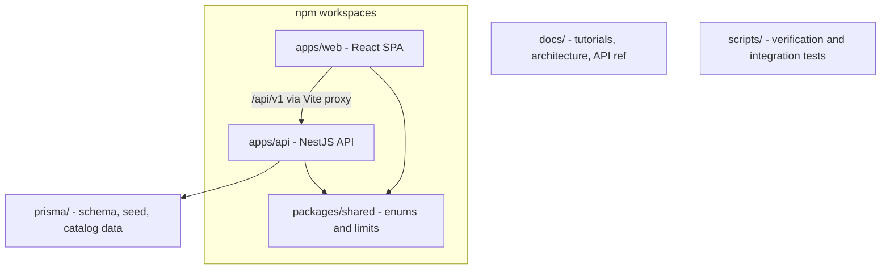
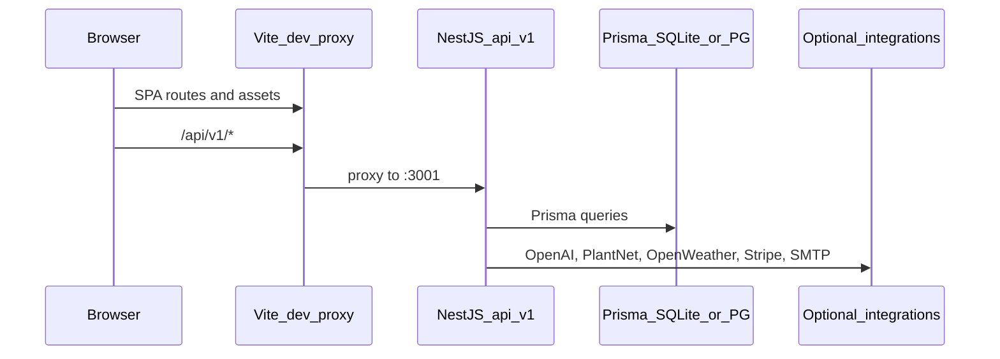
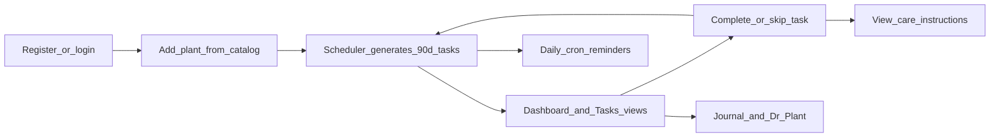

# Dr. Plant — Complete Application Overview

> **Navigation:** [Master INDEX](INDEX.md) · [System overview](architecture/system-overview.md) · [Documentation map](meta/documentation-map.md)

## What it is

**Dr. Plant** is a full-stack **personal plant garden manager**. Users register, add plants from a catalog of 240+ species, receive auto-generated care schedules (watering, pruning, and premium tasks like fertilizing/misting), complete tasks with step-by-step care instructions, keep a growth journal, and use **Dr. Plant** for AI-powered health diagnosis and chat.

It is positioned as an **MVP / SaaS-ready** product with optional paid tier (Stripe), extensive internal documentation (~100+ markdown files under [docs/](INDEX.md)), and graceful degradation when third-party API keys are missing (mocks/fallbacks).

---

## Repository layout



| Path | Role |
|------|------|
| [apps/api/](../apps/api/) | NestJS REST API, business logic, cron, integrations |
| [apps/web/](../apps/web/) | React 19 SPA (UI only) |
| [packages/shared/](../packages/shared/src/index.ts) | Shared enums + `FREE_PLANT_LIMIT` (5), `FREE_IDENTIFY_MONTHLY_LIMIT` (3) |
| [prisma/](../prisma/schema.prisma) | Schema, migrations, seed (species + care guides) |
| [docs/](INDEX.md) | Primary documentation hub |
| [scripts/](../scripts/) | Care-guide verification, integration smoke tests |

**Not a .NET project** — no `.sln` / `.csproj`. Everything is Node.js + TypeScript.

---

## Tech stack

| Layer | Technology |
|-------|------------|
| Language | TypeScript 5.7 |
| Monorepo | npm workspaces (`apps/*`, `packages/*`) |
| Backend | NestJS 10, Express, Passport JWT, class-validator, Swagger |
| Frontend | React 19, React Router 7, Vite 6, Tailwind CSS 4 |
| ORM / DB | Prisma 6 — **SQLite** default ([schema](../prisma/schema.prisma)); **PostgreSQL 16** optional via [docker-compose.yml](../docker-compose.yml) |
| Auth | JWT access + refresh, bcrypt |
| Scheduling | `@nestjs/schedule` (daily notification cron) |
| Email | Nodemailer (Gmail SMTP in dev) |
| Payments | Stripe (optional) |
| AI | OpenAI (Dr. Plant), Hugging Face fallback |
| Testing | Jest (API), Vitest + Testing Library (web) |
| CI | GitHub Actions (Node 20) in [.github/](../.github/) |

---

## How to run locally

From [README.md](../README.md):

```bash
cp .env.example .env && npm install && npm run db:generate && npm run db:push && npm run db:seed
npm run dev:api   # http://localhost:3001
npm run dev:web   # http://localhost:5173
```

- **Web app:** http://localhost:5173
- **Swagger API docs:** http://localhost:3001/api/docs
- **Health:** `/api/v1/health`

Key root scripts in [package.json](../package.json): `dev:api`, `dev:web`, `build`, `test`, `db:generate`, `db:push`, `db:migrate`, `db:seed`, `db:studio`.

---

## Architecture



**API entry:** [apps/api/src/main.ts](../apps/api/src/main.ts) — global prefix `/api/v1`, Swagger at `/api/docs`, static `/uploads/` and `/care-guides/*`.

**Web entry:** [apps/web/index.html](../apps/web/index.html) → [apps/web/src/main.tsx](../apps/web/src/main.tsx) → [apps/web/src/App.tsx](../apps/web/src/App.tsx).

**Module wiring:** [apps/api/src/app.module.ts](../apps/api/src/app.module.ts) imports Auth, Users, Species, Plants, Tasks, Scheduler, Journal, Diagnosis, Billing, Notifications, Weather, Upload, Email, Prisma, Schedule.

**Care guides** live as a Nest submodule under `apps/api/src/care-guides/` (used by Plants/Tasks, not top-level in AppModule).

---

## Data model (Prisma)

Core entities in [prisma/schema.prisma](../prisma/schema.prisma):

| Model | Purpose |
|-------|---------|
| **User** | Account, plan tier, geo/timezone, notification prefs, email verification, plant-identify quota |
| **PlantSpecies** | Shared catalog (names, `wateringFreqDays`, sunlight, toxicity, pH, care notes) |
| **Plant** | User-owned instance (nickname, location, pot size, image) |
| **Task** | Scheduled care (`TaskType`, `dueDate`, `TaskStatus`) |
| **CareGuide** / **CareGuideImage** | Instruction content by `taskType` + optional `speciesId` |
| **JournalEntry** | Notes and photos per plant |
| **Diagnosis** | One-shot health check results |
| **DiagnosisConversation** / **DiagnosisMessage** | Dr. Plant multi-turn chat |
| **Subscription** | Stripe-linked records |
| **NotificationLog** / **DeviceToken** | Reminder audit and push registration |

**Enums:** `PlanTier`, `TaskType` (WATER, FERTILIZE, PRUNE, MIST, PH_TEST, PEST_CONTROL, REPOT), `TaskStatus`, `PotSize`, `NotificationChannel`, `SubscriptionStatus`.

**Seed:** [prisma/seed.ts](../prisma/seed.ts) loads 240+ species and care guides from [prisma/data/](../prisma/data/).

---

## Core business logic

### Task scheduling

[apps/api/src/scheduler/scheduler.service.ts](../apps/api/src/scheduler/scheduler.service.ts) is the heart of the product:

- On plant create (or location change), generates **~90 days** of pending tasks
- **Watering interval** = `species.wateringFreqDays` × pot multiplier (SMALL 0.8, MEDIUM 1.0, LARGE 1.2), minimum 2 days
- **Prune** every 30 days for all users
- **PREMIUM only:** fertilize (Apr–Sep, every 30 days), mist (based on indoor/outdoor inference from location string via [growing-environment.ts](../apps/api/src/care-guides/growing-environment.ts))
- **On task complete/skip:** rolls forward next occurrence

### Care instructions

[apps/api/src/care-guides/care-guides.service.ts](../apps/api/src/care-guides/care-guides.service.ts) resolves guides by task type + species, with generic fallbacks. Content includes SVG/photo assets under `apps/api/src/care-guides/images/` and `photos/`. Served statically and via `GET /tasks/:id/instructions`.

### Weather-aware watering

[apps/api/src/weather/weather.service.ts](../apps/api/src/weather/weather.service.ts) uses OpenWeather (when `OPENWEATHER_API_KEY` set) to detect rain forecast and can **postpone watering** tasks. User lat/lon set in Settings.

### Dr. Plant diagnosis

- **One-shot:** `POST /plants/:plantId/diagnose` — image + symptoms → structured result ([diagnosis.service.ts](../apps/api/src/diagnosis/diagnosis.service.ts), [llm-diagnosis.service.ts](../apps/api/src/diagnosis/llm-diagnosis.service.ts))
- **Chat:** `/plants/:plantId/diagnose/conversations` — multi-turn with OpenAI when configured; rules/Hugging Face fallbacks otherwise
- Documented in [architecture/diagnosis-pipeline.md](architecture/diagnosis-pipeline.md)

### Notifications

[apps/api/src/notifications/notifications.cron.ts](../apps/api/src/notifications/notifications.cron.ts) — daily cron (~9:00) for due-task reminders via email (and hooks for SMS/push). Respects user `notifyEmail`, `notifyPush`, quiet hours.

---

## API surface (all under `/api/v1`)

| Area | Controller | Key endpoints |
|------|------------|---------------|
| Auth | `auth.controller.ts` | register, login, refresh, verify-email, forgot/reset password |
| Users | `users.controller.ts` | `GET/PUT /users/me`, notification settings, delete account |
| Species | `species.controller.ts` | `GET /species/search?q=`, `GET /species/:id` |
| Plants | `plants.controller.ts` | CRUD, `POST /plants/identify`, `POST /plants/upload` |
| Tasks | `tasks.controller.ts` | list by date range, complete, skip, instructions |
| Journal | `journal.controller.ts` | `GET/POST /plants/:plantId/journal` |
| Diagnosis | `diagnosis*.controller.ts` | diagnose + conversation CRUD |
| Weather | `weather.controller.ts` | `GET /users/me/weather` |
| Billing | `billing.controller.ts` | checkout (JWT), webhook (Stripe signature) |
| Devices | `notifications.controller.ts` | `POST /devices` (push tokens) |
| Health | `health.controller.ts` | health check |

Full quick reference: [reference/routes-quick-reference.md](reference/routes-quick-reference.md).

Most routes use `JwtAuthGuard`. Swagger documents DTOs.

---

## Web UI routes

From [apps/web/src/App.tsx](../apps/web/src/App.tsx):

**Public:** `/` (landing), `/login`, `/register`, `/verify-email/:token`, `/resend-verification`, `/forgot-password`, `/reset-password/:token`

**Protected garden (`/garden/*`):**

| Route | Page | Purpose |
|-------|------|---------|
| `/garden` | `Dashboard` | Plants overview, weather banner, upcoming tasks |
| `/garden/plants/new` | `AddPlant` | Species search, optional PlantNet photo ID |
| `/garden/plants/:id` | `PlantProfile` | Detail, tasks, journal, Dr. Plant chat |
| `/garden/tasks` | `Tasks` | Full task calendar/list |
| `/garden/settings` | `Settings` | Notifications, geo, account delete |
| `/garden/subscription` | `Subscription` | Stripe upgrade |

**Client state:** [AuthContext.tsx](../apps/web/src/context/AuthContext.tsx) + [services/api.ts](../apps/web/src/services/api.ts) (axios, JWT in localStorage, auto-refresh on 401).

**Key components:** `TaskRow`, `TaskInstructionsModal`, `DrPlantChat`, `Layout`, `ProtectedRoute`. (`DiagnosisResult` exists but one-shot diagnosis has **no create UI** in the SPA — see [feature availability](reference/feature-availability.md).)

---

## Authentication and billing (current MVP behavior)

**Designed behavior:**

- Register → optional email verification (when SMTP configured) → JWT
- Access + refresh tokens; bcrypt passwords
- Free tier limits: 5 plants, 3 photo identifications/month ([packages/shared](../packages/shared/src/index.ts))

**Current dev/MVP overrides** (important for anyone extending the app):

- [jwt.strategy.ts](../apps/api/src/auth/jwt.strategy.ts) line 26: **always returns `planTier: PREMIUM`** regardless of DB value
- [AuthContext.tsx](../apps/web/src/context/AuthContext.tsx) sets **`isPremium: true`** for all signed-in users in the UI
- `.env.example` has `ALL_USERS_PREMIUM=true`
- [PremiumGuard](../apps/api/src/common/guards/premium.guard.ts) always allows access ("payment disabled for now")
- Prisma `User.planTier` defaults to `PREMIUM` in schema

Stripe integration exists ([billing.service.ts](../apps/api/src/billing/billing.service.ts)) but premium gating is effectively relaxed in local/MVP mode.

**One-shot diagnosis:** API and `diagnosisApi` client exist; the web app has **no screen** to submit a one-shot diagnosis (only Dr. Plant chat and read-only past results on profile). See [feature availability](reference/feature-availability.md).

---

## Optional integrations

Configured via [.env.example](../.env.example) — app runs without them using mocks/fallbacks:

| Integration | Env vars | Used for |
|-------------|----------|----------|
| OpenAI | `OPENAI_API_KEY`, `OPENAI_MODEL` | Dr. Plant vision + chat |
| Hugging Face | `HF_API_TOKEN` | Disease image classification fallback |
| PlantNet | `PLANTNET_API_KEY` | Photo species identification |
| Perenual | `PERENUAL_API_KEY` | External species enrichment |
| OpenWeather | `OPENWEATHER_API_KEY` | Rain → postpone watering |
| SMTP | `SMTP_*`, `EMAIL_FROM` | Verification, password reset, reminders |
| Stripe | `STRIPE_*` | Premium subscription |
| S3 | `AWS_*`, `S3_*` | Production file uploads (local `UPLOAD_DIR` default) |
| Twilio / SendGrid / Firebase | various | SMS, email alt, push hooks |

Docs: [integrations/INDEX.md](integrations/INDEX.md).

---

## End-to-end user flow



1. User registers/logs in → JWT stored in browser
2. Adds plant (search species or PlantNet identify) → scheduler creates tasks
3. Dashboard/Tasks show due items → complete/skip → next occurrence scheduled
4. Task instructions pull personalized care guide content
5. Plant profile: journal, location edit (may reschedule), Dr. Plant
6. Settings: lat/lon enables weather; notification prefs control cron emails

---

## Operations and deployment

- **CI:** GitHub Actions — install, generate Prisma, test API ([operations/ci.md](operations/ci.md))
- **Deploy:** [DEPLOY.md](DEPLOY.md) — Docker multi-stage API build, static web build, production checklist
- **Postgres:** [docker-compose.yml](../docker-compose.yml) exposes PostgreSQL on port 5433
- **Verification scripts:** `scripts/verify-care-guides.mjs`, `scripts/test-integrations.mjs`

---

## Documentation map (for deeper reading)

The repo is unusually well-documented. Use the **[master INDEX](INDEX.md)** for learning paths (developer, gardener, implementer, ops), the **feature → documentation map**, and links to every layer INDEX.

Quick links: [tutorials](tutorials/INDEX.md) · [user guide](user-guide/INDEX.md) · [architecture](architecture/INDEX.md) · [feature availability](reference/feature-availability.md) · [for AI agents](meta/for-ai-agents.md)

---

## Summary

Dr. Plant is a **medium-complexity TypeScript SaaS MVP** for plant care management. Its differentiators are not simple reminders but **species-aware scheduling**, **rich care guides**, **weather logic**, and **AI diagnosis**. The codebase separates concerns cleanly (SPA + API + shared types + root Prisma), degrades gracefully without API keys, and includes production paths (Postgres, S3, Stripe, Docker) alongside frictionless SQLite local dev.

**Notable caveat for contributors:** premium tier and plan limits are implemented in schema/shared constants but **overridden to PREMIUM** in JWT validation during current MVP — re-enable real gating before shipping paid features.
